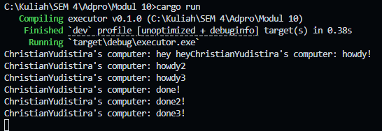
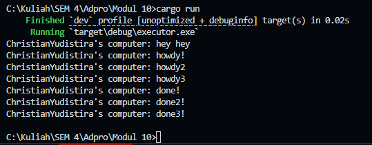

### 1.2. Understanding how it works

Program di gambar menunjukkan alur eksekusi async di Rust dengan hasil:

"ChristianYudistira's computer: howdy!" muncul terlebih dahulu
"ChristianYudistira's computer: hey hey" muncul selanjutnya
Setelah jeda 2 detik, "ChristianYudistira's computer: done!" muncul terakhir
Ini terjadi karena:

Penggunaan .await pada TimerFuture menyebabkan tugas tersebut "ditunda" sementara
Saat tugas ditunda, program tidak memblokir seluruh thread
Program dapat melanjutkan eksekusi kode lainnya (mencetak "hey hey")
Setelah waktu tunggu 2 detik selesai, eksekusi tugas yang ditunda dilanjutkan secara asingkron.

### 1.3.1 Removing drop spawner

Program menjalankan semua task async yang dijadwalkan
Program tidak berhenti setelah semua task selesai dieksekusi
Terminal tidak menampilkan prompt baru (program tetap berjalan)
Output sama seperti sebelumnya tetapi program tetap aktif

Tanpa drop(spawner), channel antara spawner dan executor tetap terbuka. Executor terus menunggu task baru yang mungkin dikirim di masa depan, meskipun tidak ada yang akan dikirim. Program tetap berjalan dalam keadaan menunggu dan tidak pernah berakhir.

### 1.3.2 Adding drop spawner

Program menjalankan semua task async yang dijadwalkan
Program berhenti setelah semua task selesai dieksekusi
Terminal menampilkan prompt baru setelah program selesai (terlihat di gambar kedua)
Urutan output: "hey hey", diikuti dengan pesan "howdy" dan akhirnya pesan "done" setelah waktu tunggu

Drop(spawner) menutup channel komunikasi antara spawner dan executor. Ketika executor menyelesaikan semua task di antrian, dia mendeteksi bahwa channel telah ditutup dan keluar dari loop while let Ok(task) = self.ready_queue.recv(), mengakhiri program.